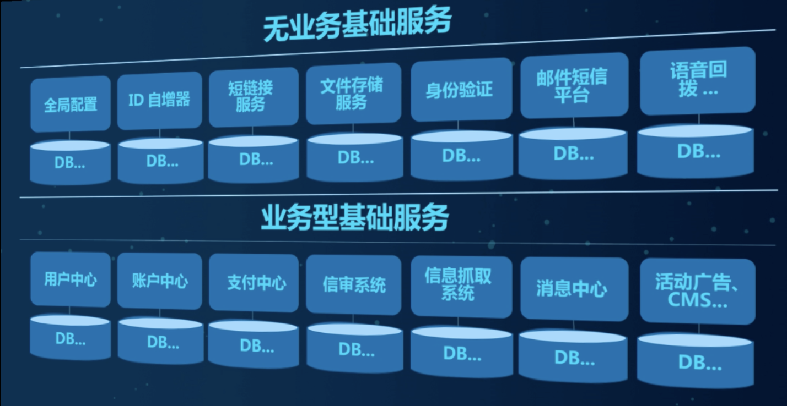

#### 微服务架构理论





#### Boot和Cloud版本


约定》配置〉编码

maven父工程

###### dependencyManagement

Maven 使用 dependencyManagement元素来提供一种管理依赖版本号的方式

通常在一个组织或者项目的最顶层的父POM中看到depencyManagement元素


使用pom.xml中的dependencyManagement元素让所有在子项目中的引用一个依赖而不用显式列出版本号.

Maven会沿着父子层级向上走,直到找到一个拥有dependencyManagement元素的项目,然后使用dependencyManagement元素指定的版本号, 避免子项目的重复声明

dependencyManagement只声明依赖,不实现引入.需要子项目去引依赖


#### 构建项目


###### maven父工程


pom文件

```xml
<?xml version="1.0" encoding="UTF-8"?>

<project xmlns="http://maven.apache.org/POM/4.0.0" xmlns:xsi="http://www.w3.org/2001/XMLSchema-instance"
  xsi:schemaLocation="http://maven.apache.org/POM/4.0.0 http://maven.apache.org/xsd/maven-4.0.0.xsd">
  <modelVersion>4.0.0</modelVersion>

  <groupId>com.elijah.cloud</groupId>
  <artifactId>cloud2022</artifactId>
  <version>1.0-SNAPSHOT</version>
  <packaging>pom</packaging>

  <modules>
    <module>cloud-provider-payment8001</module>
  </modules>


  <!-- 统一jar包版本 -->
  <properties>
    <project.build.sourceEncoding>UTF-8</project.build.sourceEncoding>
    <maven.compiler.source>1.8</maven.compiler.source>
    <maven.compiler.target>1.8</maven.compiler.target>
    <junit.version>4.12</junit.version>
    <log4j.version>1.2.17</log4j.version>
    <lombok.version>1.2.17</lombok.version>
    <mysql.version>5.1.47</mysql.version>
    <druid.version>1.1.16</druid.version>
    <mybatis.spring.boot.version>1.3.0</mybatis.spring.boot.version>
  </properties>

<!--  子模块继承之后， 提供作用：锁定版本+子module 不用写groupId和version-->
  <dependencyManagement>
    <dependencies>
      <dependency>
        <groupId>org.springframework.boot</groupId>
        <artifactId>spring-boot-dependencies</artifactId>
        <version>2.2.2.RELEASE</version>
        <type>pom</type>
        <scope>import</scope>
      </dependency>

      <dependency>
        <groupId>org.springframework.cloud</groupId>
        <artifactId>spring-cloud-dependencies</artifactId>
        <version>Hoxton.SR1</version>
        <type>pom</type>
        <scope>import</scope>
      </dependency>

      <dependency>
        <groupId>com.alibaba.cloud</groupId>
        <artifactId>spring-cloud-alibaba-dependencies</artifactId>
        <version>2.1.0.RELEASE</version>
        <type>pom</type>
        <scope>import</scope>
      </dependency>

      <dependency>
        <groupId>mysql</groupId>
        <artifactId>mysql-connector-java</artifactId>
        <version>${mysql.version}</version>
      </dependency>
      <dependency>
        <groupId>com.alibaba</groupId>
        <artifactId>druid</artifactId>
        <version>${druid.version}</version>
      </dependency>

      <dependency>
        <groupId>org.mybatis.spring.boot</groupId>
        <artifactId>mybatis-sql-spring-boot-starter</artifactId>
        <version>${mybatis.spring.boot.version}</version>
      </dependency>
    </dependencies>
  </dependencyManagement>


</project>

```


1、cloud-provider-payment8001 微服务提供者支付 

2、cloud-consumer-order80 微服务消费者订单


下单之后会调用支付服务

消费者会调用提供者


微服务模版开发步骤

1、建module

2、改POM

3、写YML

4、主启动

5、业务类


热部署只允许在开发环境使用,不然在生产环节以更变代码就重启了


#### 支付模版

cloud-provider-payment8001 微服务提供者支付 

包含业务处理逻辑


#### 视频地址

06_父工程pom文件

http://p8t8qct2x.bkt.clouddn.com/624901110-0C643DD5609F2D45.mp4?e=1662104416&token=QzW5NtLZt4W_-XAOzA7pVf9IS6KeDCpnI4k6fW4S:x5pw92T20fcxWf9rDrWGlHrYI_c=


07_复习DependencyManagement和Dependencies


http://p8t8qct2x.bkt.clouddn.com/624901110-58B4648802276393.mp4?e=1662106528&token=QzW5NtLZt4W_-XAOzA7pVf9IS6KeDCpnI4k6fW4S:xiTV-14cJKDS-chqhGiPvEFIwkA=


**08_支付模块构建(上)**


http://p8t8qct2x.bkt.clouddn.com/624901110-35C3F017D75D995A.mp4?e=1662176255&token=QzW5NtLZt4W_-XAOzA7pVf9IS6KeDCpnI4k6fW4S:HfBH5WdahUAg8cg-5xDzpXTIAHs=